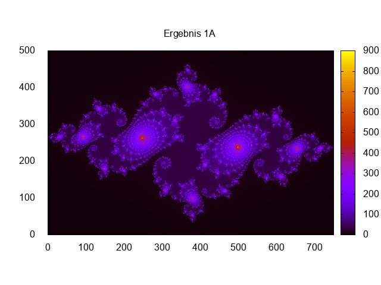
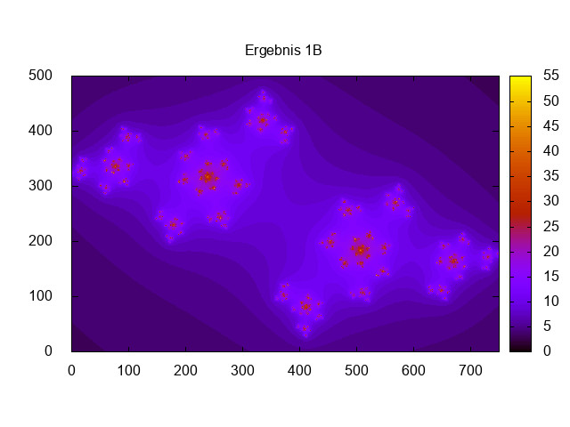
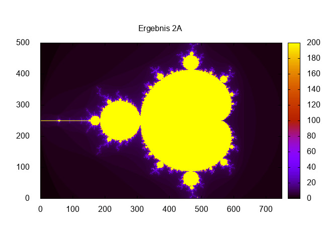
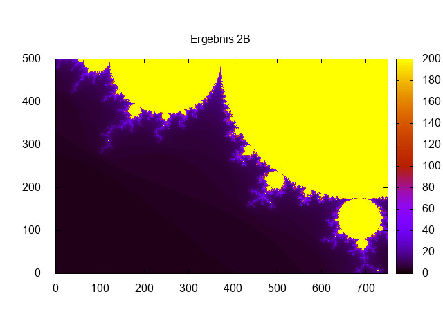
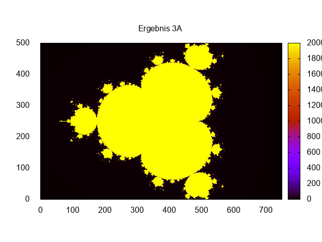

- [Richard Fehler [1839907] und Manuel Wenzel[].](#orgd88893e)
- [Source Code:](#org7b3106c)
  - [complex.h](#org73c2de7)
  - [complex.cpp](#org4143ac2)
  - [main<sub>complex</sub><sub>beispiel.cpp</sub>](#orgeec26a1)
  - [operator Schreibweise](#org877289b)
  - [konvergence.cpp](#orgeffc576)
- [Building](#orgc8a0a86)
- [Ausfuehren der Berechnung](#org8c84532)
  - [Skript:](#org73b6dd4)
- [Plots](#org28ba3ad)
  - [Skript](#org1f1db29)


<a id="orgd88893e"></a>

# Richard Fehler [1839907] und Manuel Wenzel[].

Implementierung einer Klasse komplexer Zahlen in C++ und Visualisierung vom Konvergenzverhalten komplexer Zahlenfolgen.


<a id="org7b3106c"></a>

# Source Code:


<a id="org73c2de7"></a>

## complex.h

```C++
/* complex.h */

#ifndef COMPLEX_H_
#define COMPLEX_H_
#include <cstddef>

class MyComplex {  // Beginn der MyComplex Klasse

 public:
  // Constructor
  MyComplex(const double& real, const double& imag);

  // Default Constructor
  MyComplex();

  // Copy-Constructor
  MyComplex(const MyComplex& c);

  // Destructor
  ~MyComplex();

  // Return real-part of MyComplex
  const double real() const;

  // Return imag-part of MyComplex
  const double imag() const;

  // Return norm of MyComplex
  const double norm() const;

  // Ausgabe aller Einträge
  void print(const std::string title = "",
             const int w = 8) const;  // const int w=8 default Wert für Abstand.
                                      // Übergabe bei Aufruf optional

  // Copy Operator
  MyComplex& operator=(
      const MyComplex& c);  //& was ist der Unterschied zwischen MyComplex &
                            // operator, MyComplex operator

  // MyComplex-Addition
  const MyComplex operator+(const MyComplex& c2) const;

  // MyComplex-Addition
  const MyComplex operator+(const double& skal) const;

  // MyComplex-Subtraktion
  const MyComplex operator-(const MyComplex& c2) const;

  const MyComplex operator-() const;

  // Multiplikation mit Complex
  const MyComplex operator*(const MyComplex& c2) const;
  // Multiplikation mit Skalar
  const MyComplex operator*(const double& lambda) const;

 private:
  double* dataPtr;  // pointer for data

};  // Ende der Vector Kasse
#endif
```


<a id="org4143ac2"></a>

## complex.cpp

```C++
/* complex.cpp */

#include <cassert>
#include <cmath>
#include <cstddef>
#include <cstdlib>
#include <iomanip>
#include <iostream>

#include "complex.h"

using namespace std;

// Constructor
MyComplex::MyComplex(const double& real, const double& imag) {
  this->dataPtr = new double[2];
  this->dataPtr[0] = real;
  this->dataPtr[1] = imag;
};

MyComplex::MyComplex() { this->dataPtr = new double[2]; };

// Copy-Constructor
MyComplex::MyComplex(const MyComplex& c) {
  this->dataPtr[0] = c.dataPtr[0];
  this->dataPtr[1] = c.dataPtr[1];
};

// Destructor
MyComplex::~MyComplex() { delete[] this->dataPtr; };

// Return real-part of MyComplex
const double MyComplex::real() const { return this->dataPtr[0]; };
// Return imag-part of MyComplex
const double MyComplex::imag() const { return this->dataPtr[1]; };

// Return norm of MyComplex
const double MyComplex::norm() const {
  return (sqrt((this->dataPtr[0] * this->dataPtr[0]) +
               (this->dataPtr[1] * this->dataPtr[1])));
};

// Copy Operator
MyComplex& MyComplex::operator=(const MyComplex& c) {
  delete[] this->dataPtr;
  // try to allocate memory and catch an exception

  this->dataPtr = new double[2];

  // do the copying

  this->dataPtr[0] = c.dataPtr[0];
  this->dataPtr[1] = c.dataPtr[1];

  return *this;  //*this warum *
};

// MyComplex-Addition
const MyComplex MyComplex::operator+(const MyComplex& c2) const {
  const MyComplex tmp;
  for (std::size_t m = 0; m < 2; m++)
    tmp.dataPtr[m] = this->dataPtr[m] + c2.dataPtr[m];

  return tmp;
};

const MyComplex MyComplex::operator+(const double& skal) const {
  const MyComplex tmp;
  tmp.dataPtr[0] = this->dataPtr[0] + skal;
  tmp.dataPtr[1] = this->dataPtr[1];

  return tmp;
};

// MyComplex-Substraktion
const MyComplex MyComplex::operator-(const MyComplex& c2) const {
  const MyComplex tmp;
  for (std::size_t m = 0; m < 2; m++)
    tmp.dataPtr[m] = this->dataPtr[m] - c2.dataPtr[m];

  return tmp;
};

// MyComplex-Unäres
const MyComplex MyComplex::operator-() const {
  const MyComplex tmp;
  for (std::size_t m = 0; m < 2; m++) tmp.dataPtr[m] = -(this->dataPtr[m]);

  return tmp;
};

// Multiplikation mit Skalar
const MyComplex MyComplex::operator*(const double& lambda) const {
  const MyComplex tmp;

  tmp.dataPtr[0] = lambda * this->dataPtr[0];
  tmp.dataPtr[1] = lambda * this->dataPtr[1];

  return tmp;
};

// Skalarprodukt
const MyComplex MyComplex::operator*(const MyComplex& c2) const {
  const MyComplex tmp;

  tmp.dataPtr[0] =
      (this->dataPtr[0] * c2.dataPtr[0]) - (this->dataPtr[1] * c2.dataPtr[1]);

  tmp.dataPtr[1] =
      (this->dataPtr[0] * c2.dataPtr[1]) + (this->dataPtr[1] * c2.dataPtr[0]);

  return tmp;
};
```


<a id="orgeec26a1"></a>

## main<sub>complex</sub><sub>beispiel.cpp</sub>

```C++
#include <iostream>
#include <string>
// header file for own complex number class
#include "complex.h"

using namespace std;

void output_my_cplx(const MyComplex &c, const std::string txt) {
  cout << txt << ": (" << c.real() << ", " << c.imag() << ")" << endl;
}

int main() {
  MyComplex z1{2., 7.};
  MyComplex z2{42., -9};
  MyComplex z3{-11., 19.};
  MyComplex z4, z5, z6, z7, z8, z9;

  output_my_cplx(z1, "z1 ");
  output_my_cplx(z2, "z2 ");
  output_my_cplx(z3, "z3 ");

  z4 = z1 * z2;
  output_my_cplx(z4, "z4=z1*z2 =");
  z5 = (z1 + z2);
  output_my_cplx(z5, "z5=(z1+z2) =");
  z6 = (z1 + z2) * 2.;
  output_my_cplx(z6, "z6=(z1+z2)*2. = ");
  z7 = (z2 + z3) * z1;
  output_my_cplx(z7, "z7=(z2+z3)*z1 = ");
  z8 = z1 + 5.;
  output_my_cplx(z8, "z8=z1+5. = ");
  z9 = -z1 + z2;
  output_my_cplx(z9, "z9=-z1+z2 = ");

  return 0;
}
```


<a id="org877289b"></a>

## operator Schreibweise

```C++
#include <iostream>
#include <string>
// header file for own complex number class
#include "complex.h"

using namespace std;

void output_my_cplx(const MyComplex &c, const std::string txt) {
  cout << txt << ": (" << c.real() << ", " << c.imag() << ")" << endl;
}

int main() {
  MyComplex z1{2., 7.};
  MyComplex z2{42., -9};
  MyComplex z3{-11., 19.};
  MyComplex z4, z5, z6, z7, z8, z9;

  output_my_cplx(z1, "z1 ");
  output_my_cplx(z2, "z2 ");
  output_my_cplx(z3, "z3 ");

  z4.operator=(z1.operator*(z2));
  output_my_cplx(z4, "z4=z1*z2 =");
  z5.operator=(z1.operator+(z2));
  output_my_cplx(z5, "z5=(z1+z2) =");
  z6.operator=((z1.operator+(z2)).operator*(2.));
  output_my_cplx(z6, "z6=(z1+z2)*2. = ");
  z7.operator=((z2.operator+(z3)).operator*(z1));
  output_my_cplx(z7, "z7=(z2+z3)*z1 = ");
  z8.operator=(z1.operator+(5.));
  output_my_cplx(z8, "z8=z1+5. = ");
  z9.operator=((z1.operator-()).operator+(z2));
  output_my_cplx(z9, "z9=-z1+z2 = ");

  return 0;
}
```


<a id="orgeffc576"></a>

## konvergence.cpp

```C++
#include <cmath>
#include <fstream>
#include <iostream>
#include <string>
// header file for own complex number class
#include "complex.h"
using namespace std;

int main() {
  // Variablen
  MyComplex z0, z1, c0, z_ll, z_ur;
  double x0, y0, x_m, y_m, delta_x, delta_y, tmp[2];
  int nr_iter, n_x_max, n_y_max, n_exp, n_max_iter, r_conv;
  string filename;

  // Variablen einlesen
  //"nr_inter";
  cin >> nr_iter;
  //"Wertebereich";
  cin >> x0 >> y0 >> x_m >> y_m;
  //"Unterteilung";
  cin >> n_x_max >> n_y_max;
  //"exponent";
  cin >> n_exp;
  //"Iterationsschritte";
  cin >> n_max_iter;
  //"Konvergenzradius";
  cin >> r_conv;
  //"Dateiname";
  cin >> filename;
  //"Komplexe Konstante";
  cin >> tmp[0] >> tmp[1];

  // ofstream für Ausgabedatei vorbereiten
  ofstream dateiout(filename);

  // Berechnung delta_x und delta_y
  delta_x = (x_m - x0) / n_x_max;
  delta_y = (y_m - y0) / n_y_max;

  // 2 for-Schleifen, die Intervalle durchlaufen
  for (size_t i = 0; i < n_x_max; i++) {
    for (size_t j = 0; j < n_y_max; j++) {
      // z0 und c0 für die verschiedenen Teilaufgaben und Startwerte
      switch (nr_iter) {
        case 1:
          z0 = MyComplex(x0 + i * delta_x, y0 + j * delta_y);
          c0 = MyComplex(tmp[0], tmp[1]);
          break;
        case 2:
          c0 = MyComplex(x0 + i * delta_x, y0 + j * delta_y);
          z0 = MyComplex(tmp[0], tmp[1]);
          break;
        case 3:
          c0 = MyComplex(x0 + i * delta_x, y0 + j * delta_y);
          z0 = MyComplex(tmp[0], tmp[1]);
          break;

        default:
          cout << "error";
          break;
      }

      // Variable die Iterationsschritte zählt
      int i_iter = 0;

      // while-Schleife die erst endet, wenn Konvergenzradius oder maximale
      // Iterationen erreicht
      while (z0.norm() < r_conv && i_iter < n_max_iter) {
        z1 = z0;  // Startwert z0 zuweisen

        // in for wird Potenz berechnet
        for (size_t p = 1; p < n_exp; p++) {
          z1 = z1 * z0;
        }

        z1 = z1 + c0;  // c0 dazu addieren

        z0 = z1;  // z1 ist nun der neue Wert von z0
        i_iter++;
      }

      // Ausgabedatei schreiben
      dateiout << i << " " << j << " " << i_iter << endl;
    }
  }
  cout << filename << "berechnet! " << endl;
  return 0;
}
```


<a id="orgc8a0a86"></a>

# Building

./makefile ./build<sub>konv.sh</sub>


<a id="org8c84532"></a>

# Ausfuehren der Berechnung


<a id="org73b6dd4"></a>

## Skript:

```bash
#!/usr/bin/env bash
echo 'starte Berechnung'
./konvergence<start1A.dat
echo '1A berechnet'
./konvergence<start1B.dat
echo '1B berechnet'
./konvergence<start2A.dat
echo '2A berechnet'
./konvergence<start2B.dat
echo '2B berechnet'
./konvergence<start3A.dat
echo '3A berechnet'
```


<a id="org28ba3ad"></a>

# Plots


<a id="org1f1db29"></a>

## Skript

```gp
#!/usr/bin/env gnuplot
set xrange [0:750]    
set yrange [0:500]  
set pm3d map
set term jpeg 

print" plotting"


set output "Ergebnis1A.jpeg"
set title "Ergebnis 1A"
spl './ergebnis1A.dat' u 1:2:3 with image
print  "Ergebnis 1A"
unset output
unset title
set output "Ergebnis1B.jpeg"
set title "Ergebnis 1B"
spl 'ergebnis1B.dat' u 1:2:3 with image
print  "Ergebnis 1B"
unset output
unset title

set output "Ergebnis2A.jpeg"
set title "Ergebnis 2A"
spl 'ergebnis2A.dat' u 1:2:3 with image
print  "Ergebnis 2A"
unset output
unset title

set output "Ergebnis2B.jpeg"
set title "Ergebnis 2B"
spl 'ergebnis2B.dat' u 1:2:3 with image
print  "Ergebnis 2B"
unset output
unset title

set output "Ergebnis3A.jpeg"
set title "Ergebnis 3A"
spl 'ergebnis3A.dat' u 1:2:3 with image
print  "Ergebnis 3A"
unset output
unset title
```

    
